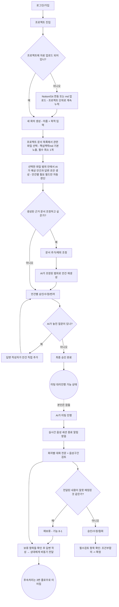
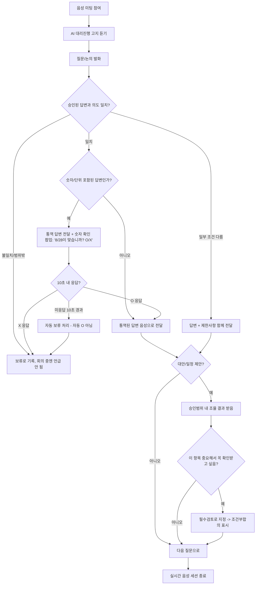
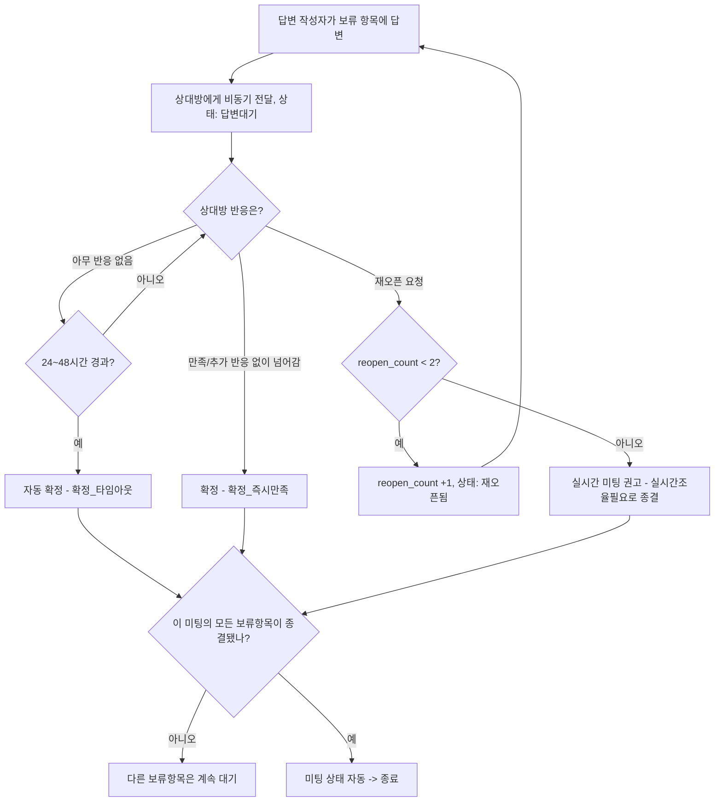

# 유저플로우 및 API 명세

두 역할(답변 작성자 / 질문 참여자) 기준으로 정리. 각 단계 옆에 관련 API·테이블을 같이 적어서, ERD → 유저플로우 → API 명세서로 바로 이어지게 했습니다.

> **버전**: v4 (비동기 후속 처리, 핑퐁 방지) 기준. 회의 생성 시 파일 선택을 필수 단계로 변경.
> 계층 구조: **프로젝트** (문서를 쌓는 단위) → **회의** (이름·목적 입력 + 파일 선택) → **안건** (회의 안의 개별 질문-답변)

---

## 1. 답변 작성자 플로우 (회의 전 → 자는 동안 → 회의 후)

| 단계 | 관련 API (예시) | 관련 테이블 |
|------|----------------|-------------|
| 문서 업로드 (프로젝트 단위, 계속 누적) | POST /projects/:id/connections, POST /connections/:id/sync | source_connections, source_documents |
| **회의 생성 (이름 + 목적)** | **POST /agendas** | **agendas** |
| **관련 파일 선택 (필수, 최소 1개)** | **POST /agendas/:id/reference-documents** | **agenda_reference_documents (added_by=user)** |
| 선택 범위 내 AI 안건 생성 (안건별 필요 필드만 자동 판단) | POST /agendas/:id/draft-positions | positions (generated_by=ai_draft, active_fields로 채워진 필드 기록) |
| 근거 문서 추가/제외 조정 (생성 후) | POST /agendas/:id/reference-documents, PATCH /agenda-reference-documents/:id | agenda_reference_documents (added_by=user 또는 excluded=true) |
| 안건 승인/수정/반려 | PATCH /positions/:id | positions (approval_status, version) |
| 안건 직접 추가 | POST /agendas/:id/positions | positions (generated_by=user, topic 신규 생성, version=1) |
| 사후검토 목록 조회 | GET /meetings/:id/meeting-logs | meeting_logs, transcripts |
| 전달내용 승인/수정/철회 | POST /meeting-logs/:id/review-actions | review_actions |
| 재보류 (전달된 내용을 다시 보류로) | POST /meeting-logs/:id/review-actions (action=재보류) | review_actions, hold_items (origin=사후_재보류) |
| 보류 항목 목록 조회 | GET /meetings/:id/hold-items | hold_items |
| 보류 항목 답변 작성 → 비동기 전달 | POST /hold-items/:id/answer | hold_items (answer_text, answered_at, delivered_to_counterpart_at) |
| 필수검토 확인 | PATCH /required-reviews/:id | required_reviews |

---

## 2. 질문 참여자(상대방) 플로우 (회의 중)

| 단계 | 관련 API (예시) | 관련 테이블 |
|------|----------------|-------------|
| 미팅 참여/고지 | POST /meetings/:id/start | meetings |
| 발화 인식 | (Agora 웹훅) POST /transcripts | transcripts |
| 답변 매칭·전달 | (내부 로직) POST /meeting-logs | meeting_logs, positions |
| 숫자/단위 감지 및 확인 팝업 노출 | POST /meeting-logs/:id/number-confirmation | number_confirmations |
| 숫자 확인 응답 (O/X/타임아웃) | PATCH /number-confirmations/:id | number_confirmations |
| 대안 조율 | POST /coordination-records | coordination_records |
| 필수검토 지정 | POST /required-reviews | required_reviews |

---

## 3. 보류 항목 비동기 후속 처리 (양쪽 역할 공통)

회의 종료 후 며칠에 걸쳐 진행될 수 있습니다.

**핵심 원칙**: 기본은 1회 답변으로 종결. 상대방의 "만족합니다" 확인을 매번 요구하지 않고, 재오픈은 능동적 행동으로만 발생. 재오픈은 항목당 최대 2회, 그 이상은 실시간 미팅 권고로 종결.

| 단계 | 관련 API (예시) | 관련 테이블 |
|------|----------------|-------------|
| 답변 작성자 답변 → 비동기 전달 | POST /hold-items/:id/answer | hold_items |
| 상대방 재오픈 | POST /hold-items/:id/reopen | hold_items (reopen_count +1, status=재오픈됨) |
| 타임아웃 자동 확정 (배치/스케줄러) | (내부 배치) PATCH /hold-items/:id | hold_items (status=확정_타임아웃) |
| 재오픈 상한 도달 → 실시간조율필요 | (내부 로직) PATCH /hold-items/:id | hold_items (status=실시간조율필요) |
| 미팅 전체 종료 여부 체크 (배치/트리거) | (내부 로직) PATCH /meetings/:id | meetings (status=종료, closed_at) |

**비즈니스 규칙**

- 미팅은 실시간 음성 세션이 끝나도 곧바로 "종료"되지 않고 "후속답변대기"로 전환됨.
- 모든 `hold_items`가 종결 상태(확정_즉시만족 / 확정_타임아웃 / 실시간조율필요)에 도달하면, 미팅은 자동으로 "종료"로 전환됨. 양측이 각자 종료 버튼을 누르는 절차는 없음 — 그 확인 과정 자체가 핑퐁을 만들기 때문.
- 재오픈은 원래 회의 중 발생한 보류(`origin=회의중_발생`)뿐 아니라, 사후 재보류(`origin=사후_재보류`)로 생긴 항목에도 동일하게 적용됨.

---

> **참고**: 다이어그램은 GitHub에서 `.md` 파일로 열면 Mermaid가 자동 렌더링됩니다.
